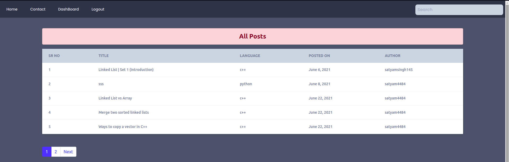
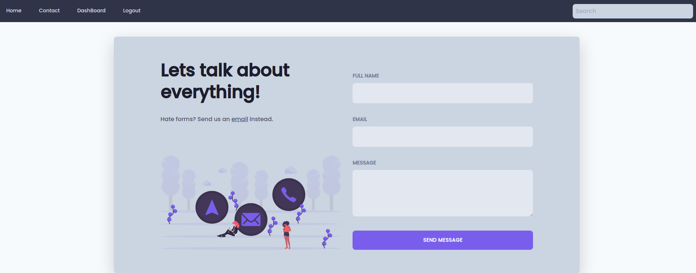
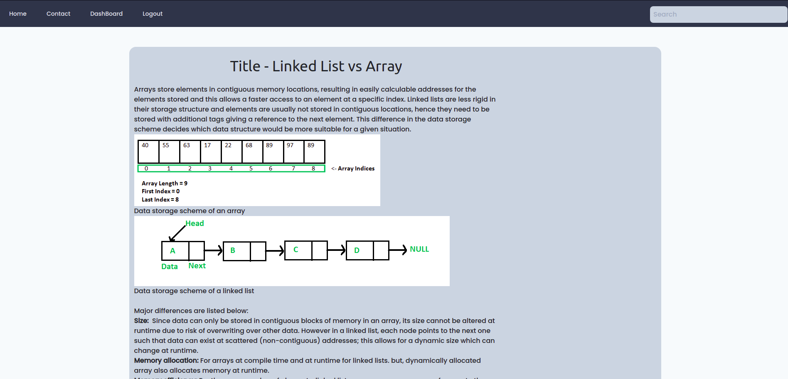
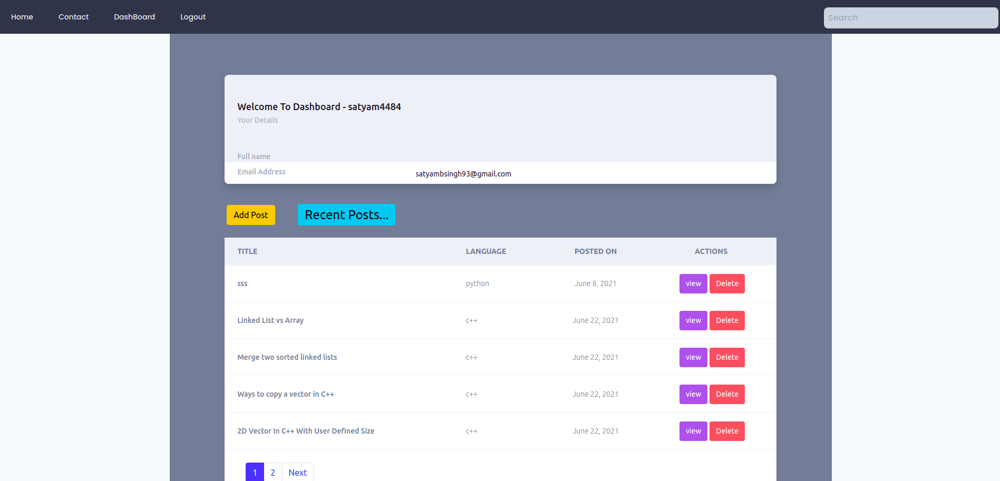

# A Coding Blog 
- A normal coding blog just created to test some basic django skills , but like that so will modify as soon as new concepts will come to mind 
_____

# project setup
- ### Install virtual environment for project 
  - #### Windows refer this -- > [windows setup](https://www.stanleyulili.com/django/how-to-install-django-on-windows/)
  - #### Ubuntu refer this ----> [ubutnut setup](https://www.javatpoint.com/django-virtual-environment-setup)
  - #### Mac refer this -------> [mac users setup](https://appdividend.com/2018/03/28/how-to-install-django-in-mac/)
- Clone this repository using the command `git clone https://github.com/satyam4484/A_Coding_Blog.git`.
- run dependencies using the command ` pip install -r requirements.txt ` , this will install all the project requirement .
- Check whether you are present in correct place where `python manage.py ` should be present .
- Run the command ` python manage.py runserver` to see whether the project starts or not , if not follow above steps properly .

____
# How does project looks like 
## 1. Home page 
  
## 2.Contact page 
  
## 3. Content page 
  
## 4.Dashboard page 
  
  
____
# Please Do Contribue and try to make it modern responsive blog . 
  
 

